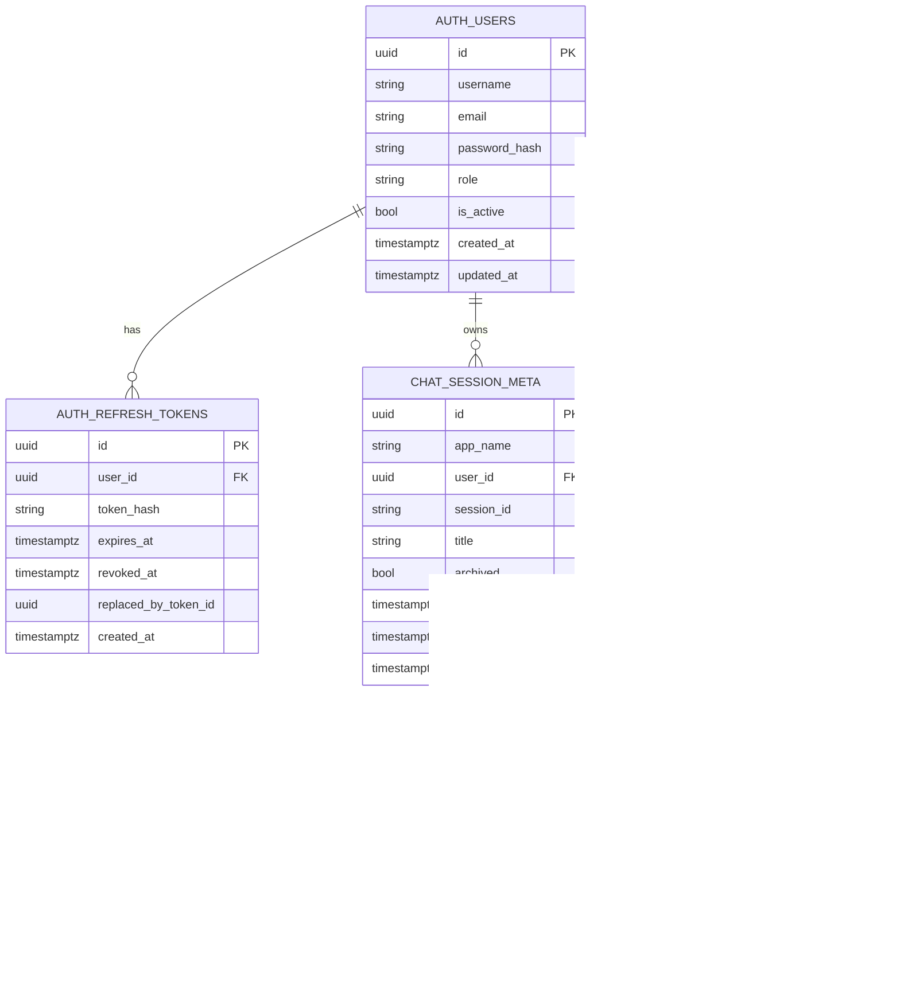

# SOC Chat Platform - Full System Guide





This document explains the full system in simple language:
- what each project does
- where data is stored
- how a request moves across services
- how sessions, users, and memory are connected

## 1) Projects and Roles

### A) ADK Backend (`/home/administrator/google-agent`)
This is your core AI agent runtime.

Main file:
- `/home/administrator/google-agent/main.py`

What it does:
- Starts ADK FastAPI server (port `8080`)
- Loads agent apps from the agent directory
- Exposes ADK routes like `/list-apps`, `/run`, `/apps/{app}/users/{user}/sessions/...`
- Stores ADK sessions/events using `SESSION_SERVICE_URI`

Current ADK session storage config:
- In `main.py`, it now defaults to Postgres via env-friendly config.

### B) Chat Gateway (`/home/administrator/chat_gateway`)
This is your authenticated API in front of ADK.

Main file:
- `/home/administrator/chat_gateway/app/main.py`

What it does:
- User auth (register/login/refresh/logout)
- JWT validation + role checks
- Chat tab metadata management
- Calls ADK backend APIs for actual AI runs
- Returns final responses/events to your chat UI

### C) OpenMemory (`/home/administrator/google-agent/OpenMemory-1.2.3`)
This is long-term memory service used by ADK memory integration.

Default behavior in its own compose:
- Metadata/vector backend defaults to SQLite unless overridden.

## 2) Storage - Exactly Where Data Lives

There are **three storage categories**:

### 1) Gateway Auth + Chat Metadata (Postgres)
Stored by `chat_gateway` migrations in DB `session` (container `chat_gateway_postgres`):
- `auth.users`
- `auth.refresh_tokens`
- `chat.session_meta`

### 2) ADK Conversation Sessions + Events (Postgres)
Stored by ADK `DatabaseSessionService` using `SESSION_SERVICE_URI`.
ADK creates tables in default schema (usually `public`), such as:
- `adk_internal_metadata`
- `sessions`
- `events`
- `app_states`
- `user_states`

### 3) OpenMemory Long-Term Memory
By default in OpenMemory compose:
- SQLite file (`OM_DB_PATH`, default `/data/openmemory.sqlite`)
- unless switched to Postgres via OpenMemory env vars.

## 3) Database-Level Relationship Between Gateway and ADK Data

There is **no direct foreign key** from ADK tables (`public.sessions`, `public.events`) to gateway tables (`auth.*`, `chat.*`).

The relationship is **logical** and enforced by application behavior:
- Gateway sets `adk_user_id = JWT.sub` (user UUID string)
- Gateway calls ADK with:
  - `app_name`
  - `user_id` (from JWT)
  - `session_id`

So records align by values, not DB FK constraints.

## 4) End-to-End Request Flow (Simple)

1. User logs in to gateway (`/v1/auth/login`)
2. Gateway returns JWTs
3. User opens/creates chat tab (`/v1/chats`)
4. Gateway creates ADK session (`/apps/{app}/users/{user}/sessions`)
5. User sends message (`/v1/chats/{session_id}/messages`)
6. Gateway calls ADK `/run` (or `/run_sse`)
7. ADK writes session/events to its session tables
8. Gateway updates `chat.session_meta.last_message_at`
9. Response returns to UI
10. ADK callback can push session to OpenMemory for long-term memory

## 4A) Login Dataflow Diagram (Files + Tables + Columns)


### Login Path - Exact Files
- API entrypoint: `app/routers/auth.py:95` (`login_user`)
- Password verify: `app/security.py:29`
- Token issue: `app/security.py:39`, `app/security.py:52`
- Refresh row insert: `app/routers/auth.py:42`, `app/routers/auth.py:47`

### Login Path - Exact Tables/Columns
- Read: `auth.users`
  - `id`, `email`, `password_hash`, `role`, `is_active`
- Write: `auth.refresh_tokens`
  - `id`, `user_id`, `token_hash`, `expires_at`, `revoked_at`, `replaced_by_token_id`, `created_at`

## 4B) After Login: Chat/Session Dataflow Diagram


### Notes
- Gateway does not directly write ADK `public.events`.
- Gateway writes auth/chat metadata; ADK writes conversation history.
- Cross-system link is value-based: `user_id` + `session_id` + `app_name`.

## 5) Active Runtime Ports and Services

Typical local runtime:
- ADK backend: `http://localhost:8080`
- Chat gateway: `http://localhost:8090`
- Gateway Postgres exposed host port: `5433` (container internal `5432`)
- OpenMemory: `http://localhost:8081`

## 6) Key Config Files

ADK backend:
- `/home/administrator/google-agent/main.py`
- `/home/administrator/google-agent/Dockerfile`

Gateway:
- `/home/administrator/chat_gateway/docker-compose.yml`
- `/home/administrator/chat_gateway/.env`
- `/home/administrator/chat_gateway/.env.example`
- `/home/administrator/chat_gateway/alembic/versions/0001_create_auth_and_chat_schemas.py`

OpenMemory:
- `/home/administrator/google-agent/OpenMemory-1.2.3/docker-compose.yml`

## 7) Gateway API Surface

Auth:
- `POST /v1/auth/register`
- `POST /v1/auth/login`
- `POST /v1/auth/refresh`
- `POST /v1/auth/logout`
- `GET /v1/me`

Chats:
- `GET /v1/chats?archived=false`
- `POST /v1/chats`
- `GET /v1/chats/{session_id}`
- `PATCH /v1/chats/{session_id}`
- `POST /v1/chats/{session_id}/messages`

Health:
- `GET /healthz`

## 8) How to Verify Data in Postgres

Enter DB:
```bash
docker exec -it chat_gateway_postgres psql -U postgres -d session
```

Check schemas:
```sql
\dn
```

Gateway tables:
```sql
\dt auth.*
\dt chat.*
```

ADK tables:
```sql
\dt public.*
```

Quick row counts:
```sql
SELECT count(*) FROM auth.users;
SELECT count(*) FROM chat.session_meta;
SELECT count(*) FROM public.sessions;
SELECT count(*) FROM public.events;
```

## 9) Docker Notes (Important)

Gateway compose overrides env to avoid common Docker mistakes:
- `DATABASE_URL` uses service DNS `postgres`
- `ADK_BASE_URL` uses `host.docker.internal:8080`
- `ADK_APP_NAME` is set to `my_agent` (must exist in ADK `/list-apps`)

If ADK app name mismatch happens, gateway startup fails with:
- `Configured ADK app '...' not found. Available apps: [...]`

## 10) Common Problems and Fixes

### Problem: Gateway cannot connect to DB
Cause:
- `DATABASE_URL` points to `localhost` inside container
Fix:
- Use `postgres` as host in container network

### Problem: ADK app validation fails on startup
Cause:
- `ADK_APP_NAME` not matching `/list-apps`
Fix:
- Set `ADK_APP_NAME` to actual app name (currently `my_agent`)

### Problem: Postgres volume/image compatibility errors
Fix:
```bash
docker compose down -v
# then up again
```

## 11) Security Model (Current)

- Password hashing: Argon2
- JWT access + refresh with rotation
- Refresh token is hashed in DB
- Chat routes require valid JWT + allowed role (`soc_analyst`/`soc_admin`)
- User identity for ADK is derived from JWT (`sub`) and cannot be overridden by frontend

## 12) What Is Not Yet Coupled by DB Constraints

Not enforced by FK today:
- `chat.session_meta` <-> `public.sessions`

They are coupled by API-level identity mapping and shared values.

## 13) Current Mental Model (One-line)

**Gateway controls identity and chat UX; ADK performs agent reasoning and stores conversation events; OpenMemory stores long-term memory.**
